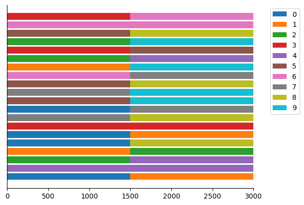
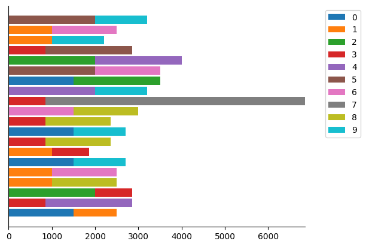
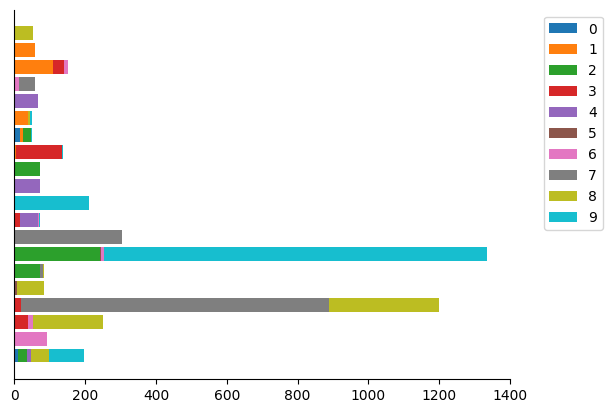
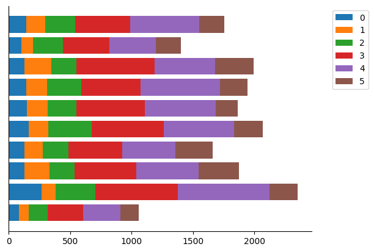

# Download Datasets 🎨

This benchmark also integrates [*LEAF*](https://github.com/TalwalkarLab/leaf), and supports *FEMNIST*, *CelebA*. For these datasets, this benchmark does not partition them further.

Most of the datasets supported by this benchmark are integrated into `torchvision.datasets`, expect *Tiny-ImageNet-200*, *Covid-19*, *Organ-S/A/CMNIST*, *DomainNet*. 

For those datasets, I prepare download scripts (in folder [`data/download`](download)) for you. 🤗

e.g.

```shell
cd data/download
sh tiny_imagenet.sh
```

# Generic Arguments 🔧
📢 All arguments have their default value.
| Arguments for general datasets | Description                                                                                                                                              |
| ------------------------------ | -------------------------------------------------------------------------------------------------------------------------------------------------------- |
| `--dataset, -d`                | The name of dataset.                                                                                                                                     |
| `--iid`                        | Non-zero value for randomly partitioning data and disabling all other Non-IID partition methods.                                                         |
| `--client_num, -cn`            | The amount of clients.                                                                                                                                   |
| `--split, -sp`                 | Chooses from `[sample, user]`.  `user`: partition clients into train-test groups; `sample`: partition each client's data samples into train-test groups. |
| `--val_ratio, -vr`             | Propotion of valset data/clients.                                                                                                                        |
| `--test_ratio, -tr`            | Propotion of testset data/clients.                                                                                                                       |
| `--plot_distribution, -pd`     | Non-zero value for saving data distribution image.                                                                                                       |

⭐ For *CIFAR-100* specifically, this benchmark supports partitioning it into the superclass category (*CIFAR-100*'s 100 classes can also be classified into 20 superclasses) by setting `--super_class` to non-zero.

# Partition Schemes 🌌

## IID


Partition data evenly. Client data distributions are similar to each other. Note that this setting has the **highest priority**, means that activating this scheme will disable all others.

✨ IID partition can only process partial datasets and combines other Non-IID schemes.

- `--iid`: Need to set in `[0, 1]`. 

```shell
python generate_data.py -d cifar10 --iid 1 -cn 20
```


```shell
# 50% data are partitioned IID, and the rest 50% are partitioned according to dirichlet parititon scheme: Dir(0.1) 
python generate_data.py -d cifar10 --iid 0.5 --alpha 0.1 -cn 20
```


## Dirichlet


Refers to [Measuring the Effects of Non-Identical Data Distribution for Federated Visual Classification (*FedAvgM*)](https://arxiv.org/abs/1909.06335). Dataset would be splitted according to $Dir(\alpha)$. Smaller $\alpha$ means stronger label heterogeneity.
  
- `--alpha, -a`: The parameter for controlling intensity of label heterogeneity.
- `--least_samples, -ls`: The parameter for defining the minimum number of samples each client would be distributed. *A small `--least_samples` along with small `--alpha` or big `--client_num` might considerablely prolong the partition.*

```shell
python generate_data.py -d cifar10 -a 0.1 -cn 20
``` 


## Shards


Refers to [Communication-Efficient Learning of Deep Networks from Decentralized Data (*FedAvg*)](https://arxiv.org/abs/1602.05629). The whole dataset would be evenly splitted into many equal-size shards.

- `--shards, -s`: Number of data shards that each client holds. The same partition method as in *FedAvg*.

```shell
python generate_data.py -d cifar10 -s 2 -cn 20
``` 



## Randomly Assigning Classes


Each client would be allocated data that belongs to `-c` classes. And classes for each client are randomly choosed.

- `--classes, -c`: Number of classes that each client's data belong to.

```shell
python generate_data.py -d cifar10 -c 2 -cn 20
``` 


## Semantic Partition 


Refers to [What Do We Mean by Generalization in Federated Learning?](https://arxiv.org/abs/2110.14216). Each client's data are correspond to a gaussian distribution that generated by a gaussian mixture model. You can learn the whole process precedure in paper's Appendix D.

- `--semantic, -sm`: Non-zero value for performing semantic partition.
- `--efficient_net_type`: The type of EfficientNet for computing the embeddings of data.
- `--pca_components`: The number of dimension for PCA decomposition.
- `--gmm_max_iter`: The maximum number of fitting iteration of the gaussian mixture model.
- `--gmm_init_params`: The way for initializing gaussian mixture model (`kmeans` / `random`).
- `--use_cuda`: Non-zero value for using CUDA to accelerate the computation. 

```shell
python generate_data.py -d cifar10 -sm 1 -cn 20
```


# Usage 🚀

## Synthetic Dataset in FedProx


Refers to [Federated Optimization in Heterogeneous Networks](https://arxiv.org/abs/1812.06127)
. The whole dataset are generated according to $(\alpha, \beta)$. Check the paper for all details.
  - `(--gamma, --beta)`: The parameters $(\alpha, \beta)$ in paper respectively. 
  - `--dimension`: The dimension of synthetic data.
  - `--iid`: Non-zero value for generating IID synthetic dataset.

```shell
python generate_data.py -d synthetic --beta 1 --gamma 1  -cn 20 
```



## The LEAF 🍂 

Argument details are in [`data/femnist/README.md`](femnist#readme) and [`data/celeba/README.md`](celeba#readme)

You should set all arguments well already when running `preprocess.sh`. 

All generic arguments (except `-d`) in `generate_data.py` will be *deactivated* when processing LEAF datasets. 

When processing LEAF datasets, `generate_data.py` only responsible for translating the output of `preprocess.sh` (json data files) to `data.npy` and `targets.npy`.

So, in summary, for using LEAF datasets, you need to:
1. `sh preprocess.sh [args...]`
2. `python generate_data.py -d [femnist, celeba]`

## Processing DomainNet 🧾
<!-- See more details in [Processing DomainNet](/data/domain/README.md). -->

### Pre-requisite 🐾

1. Through [`data/download/domain.sh`](download/domain.sh) downloading and decomporessing DomainNet raw data.
2. `cd` to `data/domain` and run `python preprocess.py` (an interactive wizard).


### Default Partitioning Scheme ❤ 

Running `python generate_data.py -d domain` *without* additional arguments would build domain separation partition (each client has only has data from one domain).
- Note that `python generate_data.py -d domain` is at the end of [`data/domain/preprocess.py`](domain/preprocess.py) already, so you don't need to run that command by yourself after running `preprocess.py`.

<p float="left">
  
   
</p>


### Extra Partitioning 💜💛

Combine argument of other schemes to build custom label heterogeneity.

Note that performing extra partitioning would make the number of clients reset by `--client_num` instead of the `client for each domain` in `preprocess.py` you set previously.

```shell
python generate_data.py -d domain -a 1.0 -cn 10
```

<p float="left">
  
   
</p>

### Out-of-Distribution Settings 🕳

Set `--ood_domains {domain_name...}` to exclude domain(s) out of data partitioning and allocate corresponding data samples to test client(s).

Note that if `--ood_domains` is not empty, FL-bench will map the data labels from the class space to the domain space. So the data hetergeneity will be observed in the domain space instead of the class space.

**One OOD domain for one test client.**

```shell
python generate_data.py -d domain -a 1.0 -cn 10 --ood_domains sketch
```
<p float="left">
  
   
</p>


```shell
python generate_data.py -d domain -a 1.0 -cn 10 --ood_domains sketch quickdraw
```

<p float="left">
  
   
</p>


# Acknowledgement 🤗

[`data/femnist`](femnist), [`data/celeba`](celeba), [`data/leaf_utils`](leaf_utils) are copied from [*LEAF*](https://github.com/TalwalkarLab/leaf) with subtle modifications to be integrated into this benchmark. [`data/femnist/README.md`](femnist#readme) and [`data/celeba/README.md`](celeba#readme) for full details.

FL-bench ignores the test set of *Tiny-ImageNet-200* due to it is unlabeled.

